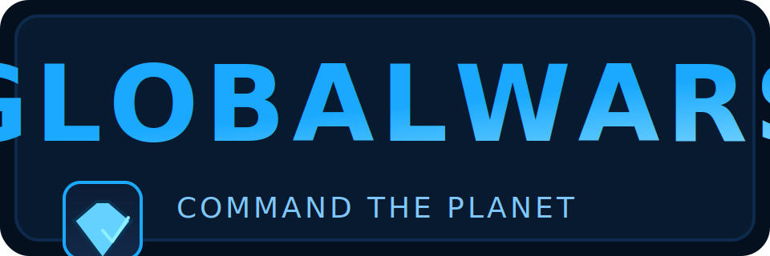

<p align="center">
  <picture>
    <source media="(prefers-color-scheme: dark)" srcset="resources/images/GlobalWarsLogoDark.svg">
    <source media="(prefers-color-scheme: light)" srcset="resources/images/GlobalWarsLogo.svg">
    
  </picture>
</p>

**GlobalWars** is an online real-time strategy game focused on territorial control and alliance building. Players command nations, form coalitions, and unleash experimental weaponry across battlefields inspired by real-world geography.

> **GlobalWars Edition**
>
> This repository powers the **GlobalWars** themed experience of OpenFront. Gameplay code remains compatible with upstream, while the client assets, palette, and onboarding copy are customized to present GlobalWars branding and attribution. Review the [GlobalWars design notes](docs/globalwars.md) for asset credits and implementation details.

This is a fork/rewrite of WarFront.io. Credit to https://github.com/WarFrontIO.

[](https://github.com/globalwars-game/GlobalWars/actions/workflows/ci.yml)
[](https://crowdin.com/project/openfront-mls)
[](https://cla-assistant.io/globalwars-game/GlobalWars)
[](https://www.gnu.org/licenses/agpl-3.0)
[](https://creativecommons.org/licenses/by-sa/4.0/)

## License

GlobalWars source code is licensed under the **GNU Affero General Public License v3.0** with additional attribution requirements inherited from OpenFront:

- Any forks or derivative works must display attribution (e.g., "Based on OpenFront", "Derived from OpenFront", "Powered by OpenFront", or "Fork of OpenFront") prominently on the main menu and/or initial title screen.

See the `ADDITIONAL TERMS` section in [LICENSE](LICENSE) for complete requirements.

### Attribution Compliance

GlobalWars continues to meet the OpenFront license obligations by:

- Displaying GlobalWars branding alongside an inline acknowledgement of OpenFront within the hero layout and help/news experiences.
- Retaining the OpenFront-derived changelog and translation pipelines referenced throughout the client.
- Preserving upstream copyright statements across [LICENSE](LICENSE), [LICENSE-ASSETS](LICENSE-ASSETS), and supporting legal documents.

For asset licensing, see [LICENSE-ASSETS](LICENSE-ASSETS).
For license history, see [LICENSING.md](LICENSING.md).

## 🌟 Features

- **Real-time Strategy Gameplay**: Expand your territory and engage in strategic battles
- **Alliance System**: Form alliances with other players for mutual defense
- **Multiple Maps**: Play across various geographical regions including Europe, Asia, Africa, and more
- **Resource Management**: Balance your expansion with defensive capabilities
- **Cross-platform**: Play in any modern web browser

## 📋 Prerequisites

- [npm](https://www.npmjs.com/) (v10.9.2 or higher)
- A modern web browser (Chrome, Firefox, Edge, etc.)

## 🚀 Installation

1. **Clone the repository**

   ```bash
   git clone https://github.com/globalwars-game/GlobalWars.git
   cd GlobalWars
   ```

2. **Install dependencies**

   ```bash
   npm i
   ```

## 🎮 Running the Game

### Development Mode

Run both the client and server in development mode with live reloading:

```bash
npm run dev
```

This will:

- Start the webpack dev server for the client
- Launch the game server with development settings
- Open the game in your default browser

### Client Only

To run just the client with hot reloading:

```bash
npm run start:client
```

### 🪟 Windows & Ubuntu workflows

The project now ships platform-aware build and tunnel scripts so you can match your local environment:

| Task                              | Windows                  | Ubuntu/WSL             | Notes                                                                   |
| --------------------------------- | ------------------------ | ---------------------- | ----------------------------------------------------------------------- |
| Production build                  | `npm run build:windows`  | `npm run build:linux`  | Sets a `PLATFORM` hint consumed by the server and webpack optimizations |
| Launch Cloudflare tunnel + server | `npm run tunnel:windows` | `npm run tunnel:linux` | Runs a production build and starts the server with OS-specific defaults |

> [!TIP]
> When using WSL, run the Linux variants from the Linux shell. Native Windows terminals (PowerShell/CMD) should use the Windows commands to ensure the correct binary paths and environment hints are applied.

### Server Only

To run just the server with development settings:

```bash
npm run start:server-dev
```

### Connecting to staging or production backends

Sometimes it's useful to connect to production servers when replaying a game, testing user profiles, purchases, or login flow.

To connect to staging api servers:

```bash
npm run dev:staging
```

To connect to production api servers:

```bash
npm run dev:prod
```

## 🔐 Authentication configuration

GlobalWars now relies on [Firebase Authentication](https://firebase.google.com/docs/auth) for Google sign-in. Supply the Firebase project identifier so the game servers can validate the ID tokens emitted by the client SDK:

| Variable                  | Description                                                                                              |
| ------------------------- | -------------------------------------------------------------------------------------------------------- |
| `FIREBASE_PROJECT_ID`     | Firebase project ID used for token verification (defaults to `globalwars-75bcf`).                        |
| `FIREBASE_PROJECT_NUMBER` | Optional Firebase project number accepted as an additional token audience (`833972164306`, for example). |
| `FIREBASE_API_KEY`        | Firebase Web API key used for fallback token introspection (defaults to the bundled client key).         |

The browser client bootstraps Firebase using the configuration in `src/client/firebase.ts`. If you fork the project, update that file with your own Firebase credentials.

`example.env` lists the environment keys with placeholder values for local development. Never commit real secrets to source control—load them via your shell or an `.env` file outside of version control instead.

## ☁️ Cloudflare tunnel configuration

The server can provision and launch Cloudflare tunnels automatically. The behaviour is controlled via environment variables so the same code path works across Windows and Ubuntu deployments.

| Variable                                    | Description                                                                                                                  |
| ------------------------------------------- | ---------------------------------------------------------------------------------------------------------------------------- |
| `CF_TUNNEL_ENABLED` / `CF_TUNNEL_DISABLED`  | Explicitly enable or disable tunnel startup (`true/false`, `yes/no`, `1/0`).                                                 |
| `CF_TUNNEL_PLATFORM`                        | Override the platform auto-detection (`win32`, `linux`, etc.). Defaults to `process.platform` or the `PLATFORM` script hint. |
| `CF_TUNNEL_ROOT_PORT`                       | Local port exposed for the primary domain (default `80`).                                                                    |
| `CF_TUNNEL_WORKER_PORT_BASE`                | Starting port for worker processes (default `3001`).                                                                         |
| `CF_TUNNEL_SETUP_RETRIES`                   | Number of provisioning retries before failing (default `3`).                                                                 |
| `CF_TUNNEL_SETUP_DELAY_MS`                  | Delay between provisioning retries in milliseconds (default `5000`).                                                         |
| `CF_TUNNEL_RUNTIME_RETRIES`                 | Overrides the `cloudflared` runtime retry count (default `15`).                                                              |
| `CF_TUNNEL_SKIP_PROVISION`                  | Skip API provisioning and reuse an existing local config (`true/false`).                                                     |
| `CF_TUNNEL_BIN`                             | Path to a custom `cloudflared` binary (useful on Windows).                                                                   |
| `CF_TUNNEL_LOGLEVEL` / `CF_TUNNEL_PROTOCOL` | Pass-through options for the spawned `cloudflared` process.                                                                  |
| `CF_TUNNEL_EXTRA_ARGS`                      | Comma or space separated list of additional CLI arguments appended after `cloudflared tunnel run`.                           |

To provision and launch a tunnel end-to-end on Windows:

```powershell
npm run tunnel:windows
```

On Ubuntu or WSL:

```bash
npm run tunnel:linux
```

Both commands perform a production build before starting the server so the tunnel points at the optimized client bundle.

## 🛠️ Development Tools

- **Format code**:

  ```bash
  npm run format
  ```

- **Lint code**:

  ```bash
  npm run lint
  ```

- **Lint and fix code**:

  ```bash
  npm run lint:fix
  ```

- **Testing**
  ```bash
  npm test
  ```

## 🏗️ Project Structure

- `/src/client` - Frontend game client
- `/src/core` - Shared game logic
- `/src/server` - Backend game server
- `/resources` - Static assets (images, maps, etc.)

## 🤝 Contributing

Contributions are welcome! Please feel free to submit a Pull Request.

1. Request to join the development [Discord](https://discord.gg/K9zernJB5z).
1. Fork the repository
1. Create your feature branch (`git checkout -b amazing-feature`)
1. Commit your changes (`git commit -m 'Add some amazing feature'`)
1. Push to the branch (`git push origin amazing-feature`)
1. Open a Pull Request

## 🌐 Translation

Translators are welcome! Please feel free to help translate into your language.
How to help?

1. Request to join the dev [Discord](https://discord.gg/K9zernJB5z) (in the application form, say you want to help translate)
1. Go to the project's Crowdin translation page: [https://crowdin.com/project/openfront-mls](https://crowdin.com/project/openfront-mls)
1. Login if you already have an account/ Sign up if you don't have one
1. Select the language you want to translate in/ If your language isn't on the list, click the "Request New Language" button and enter the language you want added there.
1. Translate the strings

### Project Governance

- The project maintainer ([evan](https://github.com/evanpelle)) has final authority on all code changes and design decisions
- All pull requests require maintainer approval before merging
- The maintainer reserves the right to reject contributions that don't align with the project's vision or quality standards

### Contribution Path for New Contributors

To ensure code quality and project stability, we use a progressive contribution system:

1. **New Contributors**: Limited to UI improvements and small bug fixes only

   - This helps you become familiar with the codebase
   - UI changes are easier to review and less likely to break core functionality
   - Small, focused PRs have a higher chance of being accepted

2. **Established Contributors**: After several successful PRs and demonstrating understanding of the codebase, you may work on more complex features

3. **Core Contributors**: Only those with extensive experience with the project may modify critical game systems

### How to Contribute Successfully

1. **Before Starting Work**:

   - Open an issue describing what you want to contribute
   - Wait for maintainer feedback before investing significant time
   - Small improvements can proceed directly to PR stage

2. **Code Quality Requirements**:

   - All code must be well-commented and follow existing style patterns
   - New features should not break existing functionality
   - Code should be thoroughly tested before submission
   - All code changes in src/core _MUST_ be tested.

3. **Pull Request Process**:

   - Keep PRs focused on a single feature or bug fix
   - Include screenshots for UI changes
   - Describe what testing you've performed
   - Be responsive to feedback and requested changes

4. **Testing Requirements**:
   - Verify your changes work as expected
   - Test on multiple systems/browsers if applicable
   - Document your testing process in the PR

### Communication

- Be respectful and constructive in all project interactions
- Questions are welcome, but please search existing issues first
- For major changes, discuss in an issue before starting work

### Final Notes

Remember that maintaining this project requires significant effort. The maintainer appreciates your contributions but must prioritize long-term project health and stability. Not all contributions will be accepted, and that's okay.

Thank you for helping make GlobalWars better!
